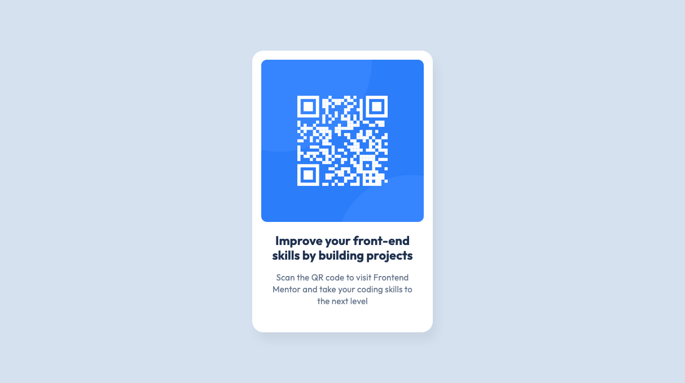

# Frontend Mentor - QR code component solution

This is a solution to the [QR code component challenge on Frontend Mentor](https://www.frontendmentor.io/challenges/qr-code-component-iux_sIO_H). Frontend Mentor challenges help you improve your coding skills by building realistic projects. 

## Table of contents

- [Overview](#overview)
  - [Screenshot](#screenshot)
  - [Links](#links)
- [My process](#my-process)
  - [Built with](#built-with)
  - [What I learned](#what-i-learned)
  - [Continued development](#continued-development)
  - [Useful resources](#useful-resources)
- [Author](#author)

## Overview

### Screenshot

### Links

- Solution URL: [Add solution URL here](https://your-solution-url.com)
- Live Site URL: [Add live site URL here](https://tonyhaohe.github.io/frontendmentors-1-qrcode/)

## My process

### Built with

- Semantic HTML5 markup
- Flexbox

### What I learned

Use this section to recap over some of your major learnings while working through this project. Writing these out and providing code samples of areas you want to highlight is a great way to reinforce your own knowledge.

Use flexbox to centre content in the middle of the page. For pulling something out of normal flow, you can use absolute position method of centring. But otherwise, there's no need. Also, I should always try to think systematically. For instance, structure the HTML going from the outside to the inside of the content using semantic HTML and as few divs as reasonable. Also, use padding when you want to push something further from its border, don't just use margin because you feel like it. There are many clear situations in my opinion. 

### Continued development

I need to practice making layouts. It should've been immediately obvious that flexbox was ideal here. 

### Useful resources

- [Example resource 1](https://www.reddit.com/r/webdev/comments/ykmcfy/how_do_you_structure_your_html_css/ ) - Great tips for structuring HTML 

## Author

- Website - [Tony He](https://www.tonyhaohe.com)
- Frontend Mentor - [@tonyhaohe](https://www.frontendmentor.io/profile/tonyhaohe)
- Linkedin - [Tony He](https://linkedin.com/in/tony-he-birmingham)